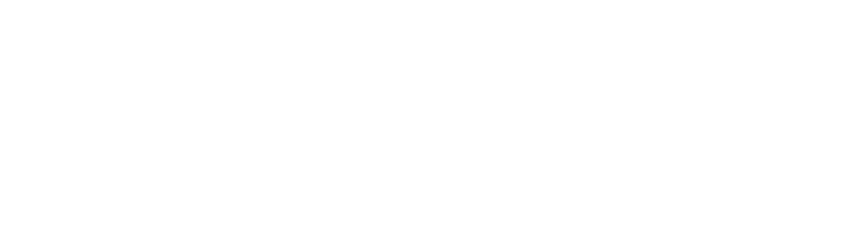

  

 

# kangcarol

#### I am a software developer, who believes creativity and analytical thinking go hand in hand when solving problems. Through my business operations experience at startups and larger corporations, I’ve managed projects with cross functional teams and stayed attuned to stakeholder and customer priorities. My approach derives from a foundation in the arts, where details, imagination, concept and message matters.

&nbsp;

  
  
  
  

&nbsp;

<!-- :envelope: -->
<!-- :page_facing_up: -->
<!-- &nbsp; -->

### Skills & ToolBox
---

  &nbsp;
  &nbsp;
  &nbsp;
  &nbsp;
  &nbsp;
  

&nbsp;

<!-- ### My Stats -->
<!-- --- -->

&nbsp;

